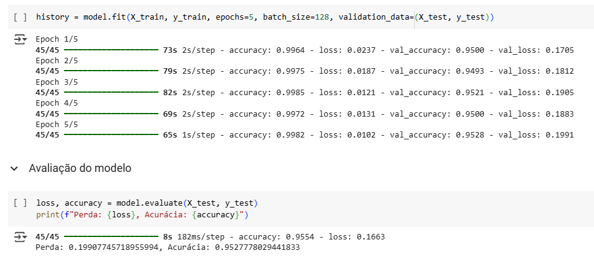

[🇧🇷] [Lê em português](README-pt.md)

# Fake News Classification System  

This repository contains a machine learning model trained to detect fake news in Portuguese, using the [Fake.br-Corpus](https://github.com/roneysco/Fake.br-Corpus) dataset. The goal is to create a neural network capable of distinguishing fake news from real news, helping to combat misinformation.  

## 📌 Technologies Used  
- Python  
- Pandas  
- TensorFlow/Keras  
- Scikit-learn  
- SpaCy  
- Unidecode  
- Google Colab  

## 📂 Project Structure  
```
/
├── br_fake_news_detector_model.ipynb  # Main notebook
├── br_fake_news_detector_model.keras  # Saved trained model
└── Fake.br-Corpus/                   # Dataset used
```  

## 🔍 How to Run the Project  

1. **Clone the repository and install dependencies:**  
```bash
!git clone https://github.com/ericshantos/br_fake_news_detector_model.git
```  

2. **Download the Fake.br-Corpus dataset:**  

> By running the first cell of the notebook, you can download the dataset  

```bash
!git clone https://github.com/roneysco/Fake.br-Corpus
```  

3. **Run the Jupyter Notebook on Google Colab or locally:**  
   - Google Colab: [Run on Colab](https://colab.research.google.com/github/ericshantos/br_fake_news_detector_model/blob/main/br_fake_news_detector_model.ipynb)  
   - Locally: `jupyter notebook br_fake_news_detector_model.ipynb`  

## 🗂️ Data Preparation  

The Fake.br-Corpus dataset contains real and fake news articles in Portuguese, organized into text files. The script performs:  
- **Reading and extracting news** (fake and real)  
- **Text cleaning** (removal of stopwords, punctuation, and accents)  
- **Tokenization** to convert words into numbers  
- **Dataset splitting** into training (80%) and testing (20%)  

## 📊 Model Construction  

The implemented neural network uses:  
- **Embedding Layer** to transform words into dense vectors  
- **Three LSTM layers** for learning textual patterns  
- **Dropout Layers** to prevent overfitting  
- **Dense layer with sigmoid activation** for binary classification  

## ⚙️ Training and Evaluation  

The model was trained with the following parameters:  
- **Epochs**: 5  
- **Batch size**: 128  
- **Optimization**: Adam  
- **Loss function**: Binary Crossentropy  

### 🎯 Results  
After training, the model achieved satisfactory accuracy in classifying real and fake news, reaching an accuracy of 93% on the test set:  

  

## 💾 Saving the Model  
The trained model is saved in Keras format for reuse in other applications:  
```python
model.save("br_fake_news_detector_model.keras")
```  

## 📜 License  

This project is licensed under the MIT License. See the LICENSE file for more details.  

---  
**Created by [Eric dos Santos](https://github.com/ericshantos)** 🚀  
