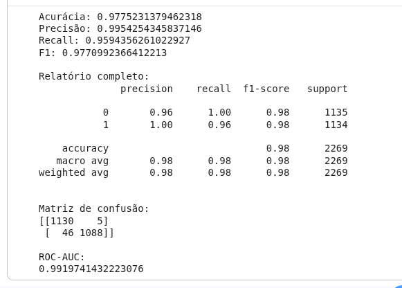

[🇺🇸] [Read in English](README.md)

# 🧠 Sistema de Classificação de Fake News (PT-BR)

Este repositório contém um modelo de machine learning para detecção de fake news em português, utilizando as base de dados [Fake.br-Corpus](https://github.com/roneysco/Fake.br-Corpus), [FakeTrue.br](https://github.com/jpchav98/FakeTrue.Br) e [FakeRecogna](https://github.com/Gabriel-Lino-Garcia/FakeRecogna).

A solução evolui de abordagens clássicas com LSTM para o uso de modelos baseados em Transformers, como o BERT, permitindo capturar melhor o contexto semântico das notícias.

---

## 🤗 Modelo no Hugging Face

O modelo treinado está disponível publicamente no Hugging Face Hub:

👉 [https://huggingface.co/ericshantos/veritasseq/](https://huggingface.co/ericshantos/veritasseq/)

---

# 🚀 Objetivo

Desenvolver um sistema capaz de classificar automaticamente notícias como **verdadeiras** ou **falsas**, auxiliando no combate à desinformação em língua portuguesa.

---

# 🧪 Tecnologias Utilizadas

* Python
* Pandas
* PyTorch
* Scikit-learn
* Jupyter Notebook
* Hugging Face Transformers (BERT)

---

## 📂 Dataset (Expansão de Dados)
A versão atual do projeto utiliza uma base consolidada de três grandes fontes, triplicando o volume de dados original para garantir maior poder de generalização:

| Fonte | Descrição |
| :--- | :--- |
| **Fake.br-Corpus** | Dataset de referência com notícias reais e falsas. |
| **FakeTrue.br** | Base complementar de notícias em português. |
| **FakeRecogna** | Dataset expandido para maior diversidade de temas. |

* **Volume Total:** ~22.684 notícias (anteriormente ~7.000).
* **Distribuição:** 90% treino / 10% teste com amostragem estratificada.

---

## 🧠 Arquitetura do Modelo (BERT)
O modelo utiliza o **BERTimbau** (BERT base para Português) como base, com uma cabeça de classificação personalizada:

* **Encoder:** `neuralmind/bert-base-portuguese-cased`.
* **Cabeça de Classificação:**
    * Linear (Hidden Size → 32) + Ativação GELU.
    * Dropout (0.2) para regularização.
    * Linear (32 → 16) + Ativação GELU.
    * Linear (16 → 1) para saída binária.
* **Otimização:** Adam com Learning Rate de $5e^{-5}$.

## ⚙️ Pipeline de Dados
O processamento agora conta com extratores específicos para cada base (`BaseExtractor`):
1.  **Extração:** Parsing de arquivos `.txt` (Fake.br), `.csv` (FakeTrue) e `.xlsx` (FakeRecogna).
2.  **Limpeza:** Remoção de valores nulos e normalização de rótulos.
3.  **Tokenização:** WordPiece (BERT) com `max_length=256`.
4.  **Dataloader:** Implementação com `pin_memory` e `prefetch_factor` para otimização de GPU.

---

## ⚙️ Treinamento

### 📌 Hiperparâmetros (LSTM)

* Épocas: 5
* Batch size: 128
* Otimizador: Adam
* Loss: Binary Crossentropy

### 📌 BERT (Fine-tuning)

* Learning rate: ~2e-5
* Batch size: 32
* Uso de GPU recomendado

---

## 📊 Resultados

O modelo LSTM atingiu aproximadamente **97% de acurácia** no conjunto de teste.

> Modelos baseados em BERT apresentam potencial de melhoria significativa ao capturar melhor o contexto linguístico.



---

## 🚀 Como Utilizar o Modelo

O modelo pode ser carregado diretamente via Transformers:

```python
import torch
from transformers import AutoModelForSequenceClassification, AutoTokenizer

device = torch.device("cuda" if torch.cuda.is_available() else "cpu")

model_name = "neuralmind/bert-base-portuguese-cased"

tokenizer = AutoTokenizer.from_pretrained(model_name)

model = AutoModelForSequenceClassification.from_pretrained(
    model_name,
    num_labels=2  
)

state_dict = torch.load("veritas-bert-ptbr.pth", map_location=device)

model.load_state_dict(state_dict)

model.to(device)
model.eval()
```

---


## ▶️ Como Executar

1. Clone o repositório:

```bash
git clone https://github.com/ericshantos/veritas_br.git
```

2. Execute o notebook:

* [Executar no Google Colab](https://colab.research.google.com/github/ericshantos/br_fake_news_detector_model/blob/main/br_fake_news_detector_model.ipynb)
* Ou localmente:

```bash
jupyter notebook veritasBR.ipynb
```

---

## 💡 Insights do Projeto

* Modelos LSTM são eficientes, mas limitados semanticamente
* BERT melhora significativamente a compreensão de contexto
* Tokenização é um fator crítico para performance

---

## 💐 Agradecimentos

Dedico este projeto aos meus professores do Ensino Médio, que contribuíram para o desenvolvimento do meu senso crítico.

Agradeço especialmente às pessoas que incentivaram a curiosidade, o questionamento e a busca pelo conhecimento.

---

# 📜 Licença

Este projeto está sob a licença MIT. Veja [LICENSE](./LICENSE) para mais detalhes.

---

# 👨‍💻 Autor

Desenvolvido por Eric dos Santos 🚀
